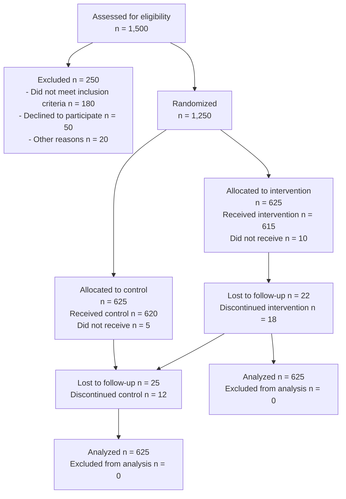
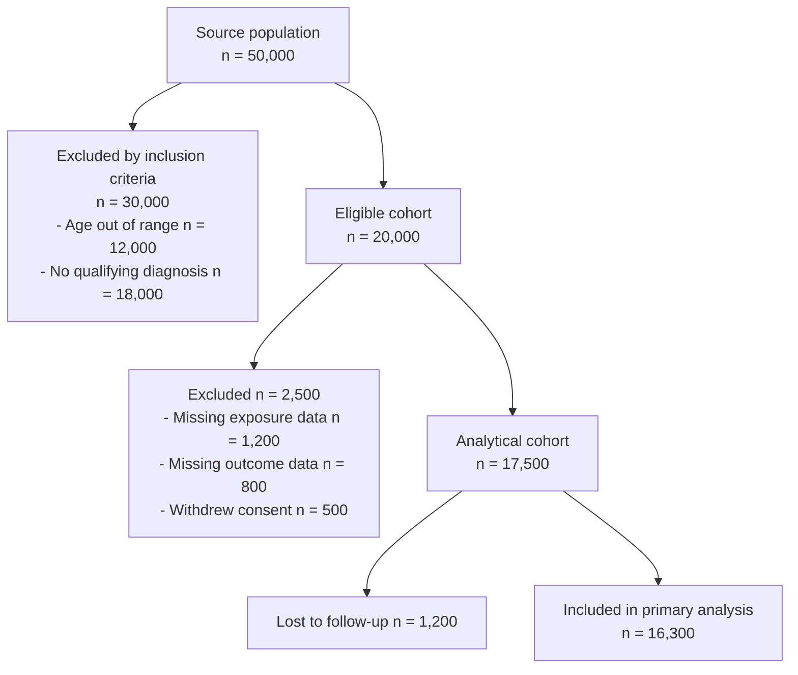
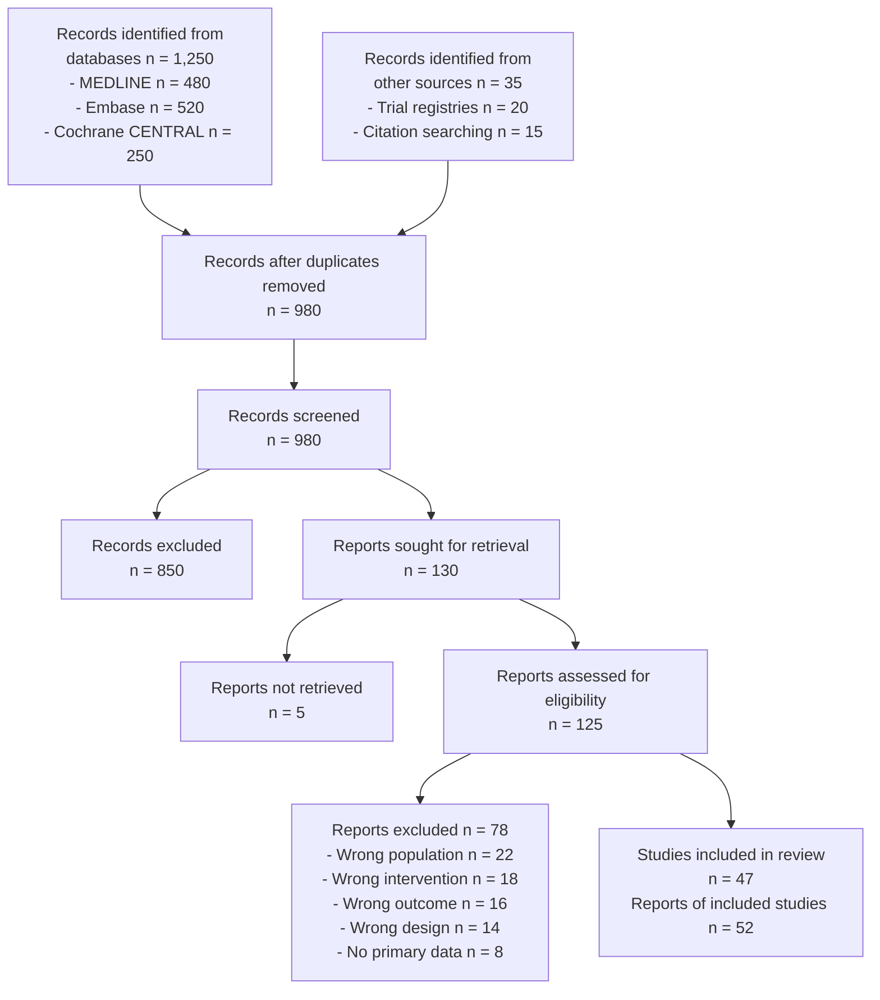
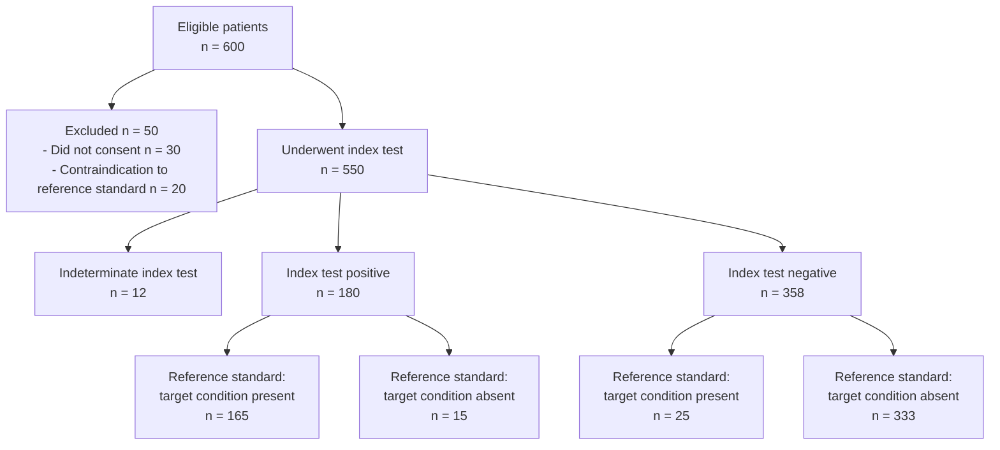
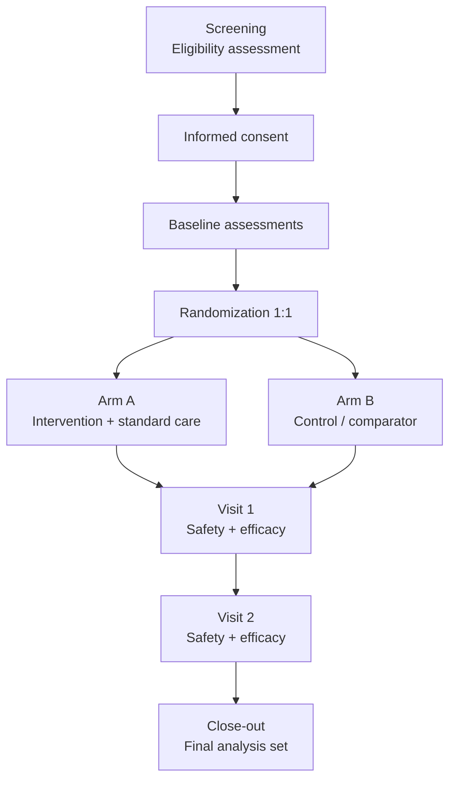
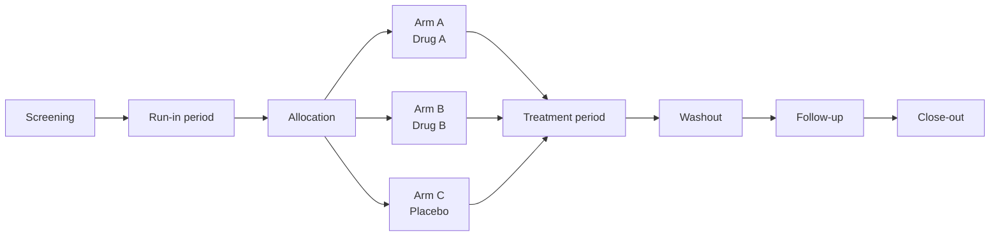
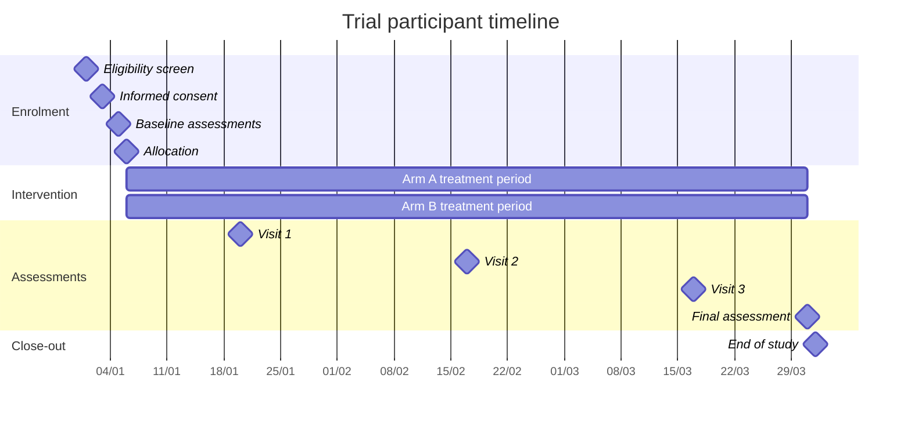
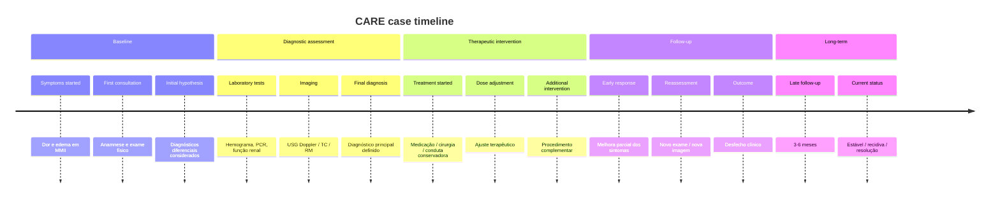
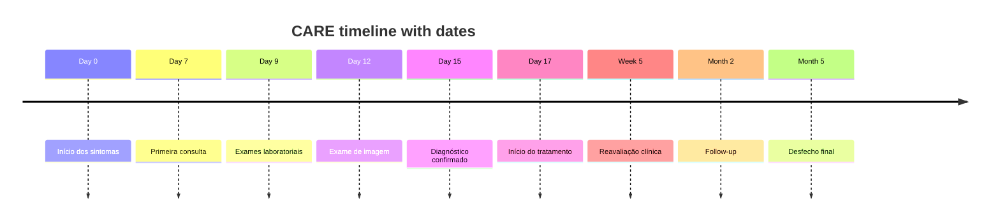
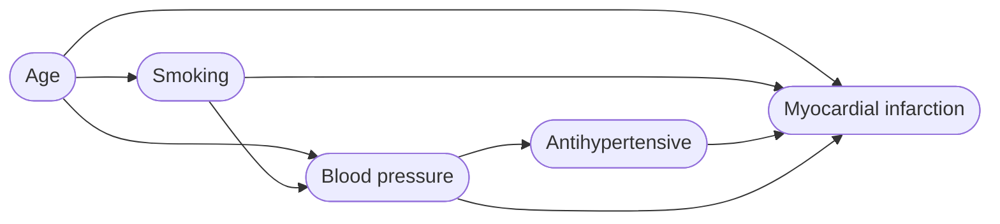

# Diagrams and Figures for Medical Manuscripts

This file contains ready-to-use templates for the diagrams that medical manuscripts require, plus pointers for the statistical figures that must be generated from data rather than from text.

The default text-to-diagram tool is **Mermaid**: free, version-controllable, renders inline in GitHub, GitLab, Notion, Obsidian, and most Markdown viewers, and exports to SVG. For reproducible PRISMA 2020 flow diagrams, the `PRISMA2020` R package is the gold standard. For DAGs, DAGitty.

## Contents

1. [Quick Selector](#quick-selector) — diagram type × reporting standard × tool
2. [Export Rules](#export-rules)
3. [CONSORT Participant Flow](#consort-participant-flow) — enciclopedia.med.br/consort2010 web tool (parallel-2/3, crossover, cluster, factorial) + Mermaid fallback
4. [STROBE Participant Flow](#strobe-participant-flow) — observational (Mermaid template)
5. [PRISMA 2020 Flow](#prisma-2020-flow) — enciclopedia.med.br/prisma2020 web tool + `PRISMA2020` R package + Mermaid fallback
6. [STARD Flow](#stard-flow) — diagnostic accuracy (Mermaid template)
7. [Trial Design Schema](#trial-design-schema) — parallel and three-arm patterns
8. [Trial Gantt Timeline](#trial-gantt-timeline) — SPIRIT participant timeline
9. [CARE Patient Timeline](#care-patient-timeline) — enciclopedia.med.br/care-timeline web tool (section, hybrid, date modes) + Mermaid fallback
10. [Causal DAG](#causal-dag) — DAGitty
11. [Forest Plot (Meta-Analysis)](#forest-plot-meta-analysis) — R `metafor`, RevMan, Stata
12. [Kaplan-Meier Survival Curve](#kaplan-meier-survival-curve)
13. [Funnel Plot](#funnel-plot)
14. [ROC Curve](#roc-curve)
15. [Calibration Plot](#calibration-plot) — TRIPOD
16. [Renderers and Workflow](#renderers-and-workflow) — Mermaid CLI, PRISMA2020 web app
17. [Best Practices for All Diagrams](#best-practices-for-all-diagrams)
18. [Cross-References](#cross-references-within-this-skill)

## Quick Selector

| Diagram | Required by | Best tool | Section in this file |
| --- | --- | --- | --- |
| Participant flow (RCT) | CONSORT (mandatory) | enciclopedia.med.br/consort2010 web tool; Mermaid fallback | [CONSORT](#consort-participant-flow) |
| Participant flow (cohort / case-control / cross-sectional) | STROBE (recommended) | Mermaid `flowchart` | [STROBE](#strobe-participant-flow) |
| Study selection (systematic review) | PRISMA 2020 (mandatory) | enciclopedia.med.br/prisma2020 web tool; `PRISMA2020` R package; or Mermaid | [PRISMA](#prisma-2020-flow) |
| Study flow (diagnostic accuracy) | STARD (mandatory) | Mermaid `flowchart` | [STARD](#stard-flow) |
| Trial design schema | SPIRIT (recommended for protocols) | Mermaid `flowchart` | [Trial schema](#trial-design-schema) |
| Trial timeline / Gantt | SPIRIT (optional) | Mermaid `gantt` | [Trial Gantt](#trial-gantt-timeline) |
| Patient timeline (case report) | CARE (mandatory) | enciclopedia.med.br/care-timeline web tool; Mermaid fallback | [CARE timeline](#care-patient-timeline) |
| Causal DAG | None (recommended for observational) | DAGitty | [DAG](#causal-dag) |
| Forest plot (meta-analysis) | PRISMA (mandatory) | R: `metafor`, `meta`, `forestplot`; or RevMan | [Forest plot](#forest-plot-meta-analysis) |
| Kaplan-Meier survival | None (standard for time-to-event) | R: `survival` + `survminer` | [Kaplan-Meier](#kaplan-meier-survival-curve) |
| Funnel plot | PRISMA when ≥ 10 studies | R: `metafor`, `meta` | [Funnel plot](#funnel-plot) |
| ROC curve | STARD (recommended) | R: `pROC`; Python: `scikit-learn` | [ROC curve](#roc-curve) |
| Calibration plot | TRIPOD (recommended) | R: `rms`, `CalibrationCurves` | [Calibration plot](#calibration-plot) |

## Export Rules

Most journals require:

1. **Vector format (SVG, EPS, or PDF)** for line art, including all flow diagrams. Vectors scale without loss.
2. **Raster format (TIFF or PNG)** at ≥ 300 dpi for halftone images (photographs, histology).
3. Submit each figure as a **separate file**, not embedded in the manuscript.
4. Use a **descriptive filename**: `Figure1.svg`, `Figure2.tif`, etc.
5. Verify the journal's Instructions to Authors for required color space (RGB vs. CMYK), maximum width, font requirements, and resolution.

For Mermaid-generated figures, render to SVG with the Mermaid CLI:

```bash
npx -p @mermaid-js/mermaid-cli mmdc -i diagram.mmd -o Figure1.svg
```

For PRISMA flow diagrams generated with the R package, export directly to PDF/PNG (see PRISMA section below).

## CONSORT Participant Flow

Mandatory for randomized controlled trials (CONSORT 2010, item 13). Place as **Figure 1** of the manuscript, cited in the Results section before any other figure.

The four canonical rows are: **Enrollment → Allocation → Follow-up → Analysis**. Reasons for exclusion at each step must be specified.

Two options. Option 1 (the browser-based generator) is **preferred** because it supports all five CONSORT trial designs and produces a publication-ready SVG with proper attribution metadata.

### Option 1 (preferred) — enciclopedia.med.br/consort2010

A free single-file generator at **https://enciclopedia.med.br/consort2010**. Runs entirely in the browser, no server or installation required. Supports all five CONSORT 2010 trial designs:

| `design` value | When to use |
| --- | --- |
| `parallel-2` | Standard 2-arm RCT (intervention vs. control) |
| `parallel-3` | Three parallel groups (e.g., two doses + control) |
| `crossover` | Two-sequence, two-period crossover (AB / BA) |
| `cluster` | Cluster RCT — clusters randomised, not individuals |
| `factorial` | 2 × 2 factorial — four arms |

Output: SVG (vector, scales without loss) and PNG. Released under CC BY 4.0.

#### Minimal example — standard parallel 2-arm RCT

```js
const data = {
  design: 'parallel-2',
  enrl_assessed: 1500,
  enrl_excl_criteria: 180,    // not meeting inclusion criteria
  enrl_excl_declined: 50,
  enrl_excl_other: 20,
  enrl_randomised: 1250,
  arms: [
    {
      label: 'Intervention',
      alloc_n: 625, received: 615, not_received: 10,
      not_received_reasons: [{ t: 'Withdrew consent', n: 10 }],
      lost: 22, lost_reasons: [{ t: 'Moved away', n: 22 }],
      discont: 18, discont_reasons: [{ t: 'Adverse event', n: 18 }],
      analysed: 625, excl_analysis: 0, excl_analysis_reasons: [],
    },
    {
      label: 'Control',
      alloc_n: 625, received: 620, not_received: 5,
      not_received_reasons: [{ t: 'Withdrew consent', n: 5 }],
      lost: 25, lost_reasons: [{ t: 'Moved away', n: 25 }],
      discont: 12, discont_reasons: [{ t: 'Lack of efficacy', n: 12 }],
      analysed: 625, excl_analysis: 0, excl_analysis_reasons: [],
    },
  ],
};
```

#### Crossover variant (AB / BA sequences)

For `design: 'crossover'`, each arm represents a **sequence**, and the standard follow-up fields are replaced by per-period fields:

```js
{
  label: 'Sequence AB',
  alloc_n: 34,
  p1_received: 34, p1_not_completed: 0, p1_reasons: [],
  p2_received: 33, p2_not_completed: 1,
  p2_reasons: [{ t: 'Adverse event', n: 1 }],
  analysed: 33, excl_analysis: 1, excl_analysis_reasons: [],
}
```

#### Cluster variant

For `design: 'cluster'`, both clusters and participants are tracked separately at enrollment and per arm:

```js
// Extra enrollment fields
enrl_clusters_assessed: 20,
enrl_clusters_excl: 4,
enrl_clusters_rand: 16,

// Per-arm fields replace the individual follow-up
arms: [
  { label: 'Intervention clusters',
    cl_alloc: 8, part_alloc: 240,
    cl_analysed: 8, part_analysed: 235 },
  { label: 'Control clusters',
    cl_alloc: 8, part_alloc: 240,
    cl_analysed: 8, part_analysed: 230 },
]
```

#### Workflow (recommended)

1. Extract the trial design from the Methods section (`parallel-2`, `parallel-3`, `crossover`, `cluster`, or `factorial`).
2. Extract enrollment counts (assessed, exclusion reasons, randomised).
3. Extract per-arm counts (allocated, received, not received, lost, discontinued, analysed, excluded from analysis) with reasons.
4. For crossover: extract period 1 and period 2 counts separately.
5. For cluster: also extract cluster counts at each step.
6. Open https://enciclopedia.med.br/consort2010, paste the data, and export as SVG.

#### Citation required (CC BY 4.0)

Tool citation:

> Amato ACM. CONSORT 2010 Flow Diagram Generator [Internet]. São Paulo: enciclopedia.med.br; 2025 [cited 2025]. Available from: https://enciclopedia.med.br/consort2010

Plus the canonical CONSORT 2010 reference:

> Schulz KF, Altman DG, Moher D; CONSORT Group. CONSORT 2010 statement: updated guidelines for reporting parallel group randomised trials. BMJ. 2010;340:c332. doi:10.1136/bmj.c332

### Option 2 — Mermaid (when the web tool is unavailable)

For a quick draft or version-controllable source, Mermaid covers parallel 2-arm trials:



Customize the numbers and reasons in each box. Always show every reason for exclusion at the eligibility, allocation, follow-up, and analysis steps. Keep boxes short; long text goes in the figure caption.

For crossover, cluster, factorial, or ≥3 arms, the web generator (Option 1) is strongly preferred — Mermaid does not handle those layouts cleanly.

## STROBE Participant Flow

Recommended for observational studies (STROBE item 13). Place as **Figure 1**.



For case-control studies, replace the cohort flow with parallel "Cases" and "Controls" branches showing source, eligibility, and matching steps for each.

## PRISMA 2020 Flow

Mandatory for systematic reviews and meta-analyses (PRISMA 2020). Three options.

### Option 1 (browser-based, recommended for most users) — enciclopedia.med.br/prisma2020

A free single-file generator at **https://enciclopedia.med.br/prisma2020**. Runs entirely in the browser, no server or installation required. Exports SVG and PNG. Available in English and Portuguese. Released under CC BY 4.0.

A companion **Node.js module** (`prisma2020_gen.js`) lets you generate the diagram programmatically:

```js
const { buildSVG } = require('./prisma2020_gen');

const svg = buildSVG({
  lang: 'en',                    // 'en' or 'pt'
  db: 1500, reg: 0,              // identification — databases and registers
  web: 12, org: 5, cit: 8, oth: 3, // identification — other methods
  dup: 320, auto: 0, orem: 15,   // before screening — removed
  scr: 1180, scr_ex: 900,        // screening
  sou: 280, nret: 18,            // retrieval
  ass: 262,                      // eligibility
  reasons: [
    { t: 'Wrong population',   n: 40 },
    { t: 'Wrong intervention', n: 85 },
    { t: 'Wrong outcomes',     n: 30 },
  ],
  nstu: 107, nrep: 120,          // new studies / reports
  has_prev: false,               // set true for updated review (adds previous-studies column)
  show_tool_cite: true,
  show_prisma_ref: true,
});
require('fs').writeFileSync('Figure1_PRISMA.svg', svg);
```

CLI usage:

```bash
node prisma2020_gen.js data.json output.svg
echo '{"db":1500,"scr":1180}' | node prisma2020_gen.js
```

**Updated reviews** (`has_prev: true`) automatically render the "Previous studies" column to the left of the main flow; supply `pstu`, `prep`, `tstu`, `trep` (totals = new + previous).

**Citation required** (CC BY 4.0):

> Amato A. PRISMA 2020 Flow Diagram Generator [Internet]. São Paulo: enciclopedia.med.br; 2025 [cited 2025]. Available from: https://enciclopedia.med.br/prisma2020

Plus the canonical PRISMA 2020 reference:

> Page MJ, McKenzie JE, Bossuyt PM, et al. The PRISMA 2020 statement: an updated guideline for reporting systematic reviews. BMJ. 2021;372:n71. doi:10.1136/bmj.n71

### Option 2 — `PRISMA2020` R package

The **PRISMA2020 R package** (https://cran.r-project.org/web/packages/PRISMA2020/) and its companion app (https://github.com/prisma-flowdiagram/PRISMA2020) generate the canonical PRISMA 2020 flow diagram from a structured CSV. It produces a publication-ready SVG/PDF identical in style to the PRISMA Statement examples.

Workflow:

```r
# Install
install.packages("PRISMA2020")

# Run with your data
library(PRISMA2020)
data <- read.csv("prisma_data.csv")        # template at the package URL
plot <- PRISMA_flowdiagram(
  data,
  interactive   = FALSE,
  previous      = FALSE,                   # set TRUE for "previous studies" arm
  other         = TRUE,                    # set FALSE if no grey-literature arm
  fontsize      = 12,
  font          = "Helvetica",
  title_colour  = "Goldenrod1",
  greybox_colour = "Gainsboro",
  main_colour    = "Black",
  arrow_colour   = "Black",
  arrow_head     = "normal",
  arrow_tail     = "none"
)

# Export
PRISMA_save(plot, filename = "Figure1_PRISMA.pdf", filetype = "PDF")
PRISMA_save(plot, filename = "Figure1_PRISMA.svg", filetype = "SVG")
```

A **web app version** (no R required) is also available at https://estech.shinyapps.io/prisma_flowdiagram/. It accepts the same CSV format and exports to PDF/SVG/PNG/HTML.

### Option 3 — Mermaid (when neither the web tool nor R is available)



Use Mermaid only if neither the web generator nor the R package is available. For a publication-quality diagram, prefer Option 1 (web generator) for ease and Option 2 (R package) for fully reproducible scripts.

## STARD Flow

Mandatory for diagnostic accuracy studies (STARD 2015, item 19). Show flow of participants through the index test and reference standard, with cross-tabulation of results.



Show how indeterminate results were handled. Include a 2×2 cross-tabulation table separately.

## Trial Design Schema

A schema figure visualizes the study design at a glance. Useful in protocols (SPIRIT) and pragmatic trial manuscripts. Two common patterns.

### Two-arm parallel design



### Three-arm with run-in and washout



## Trial Gantt Timeline

A Gantt visualization of the participant journey makes the timing of visits and assessments concrete. Particularly useful in protocols.

**SPIRIT Item 18 (Participant timeline)** explicitly recommends a schematic diagram to efficiently present the overall schedule and time commitment for trial participants in each study group (https://www.consort-spirit.org/item18-participanttimeline). Key elements to convey:

1. **Timeline of trial visits**, starting from initial eligibility screening through to study close-out.
2. **Timeline of interventions**, including any run-in and washout periods.
3. **Procedures and assessments performed at each visit**, referencing specific data collection forms when relevant.

Two complementary formats are typically used: a **schedule of enrolment, interventions, and assessments** (SPIRIT figure: rows = activities and assessments, columns = study timepoints — `−t1`, `0`, `t1`, `t2`, ..., `tx`) and a **Gantt/timeline visualization** of durations and milestones.



For a SPIRIT-style schedule of enrolment, interventions, and assessments table, a tabular form (rows: assessments; columns: timepoints `−t1, 0, t1, t2, ..., tx`) is usually clearer than a Gantt and is the format the SPIRIT statement recommends. Use a Word table for that; use the Gantt above for narrative communication of timing.

### SPIRIT-style schedule (sketch in Markdown)

```
| Activity                          | -t1 | 0 | t1 | t2 | t3 | tx |
|-----------------------------------|-----|---|----|----|----|----|
| Eligibility screen                | X   |   |    |    |    |    |
| Informed consent                  | X   |   |    |    |    |    |
| Allocation                        |     | X |    |    |    |    |
| Intervention (Arm A)              |     |   | -- | -- | -- |    |
| Intervention (Arm B)              |     |   | -- | -- | -- |    |
| Baseline outcomes                 |     | X |    |    |    |    |
| Primary outcome                   |     |   | X  | X  | X  |    |
| Adverse events                    |     |   | X  | X  | X  | X  |
| Quality of life                   |     | X |    | X  |    | X  |
| Final assessment / close-out      |     |   |    |    |    | X  |
```

## CARE Patient Timeline

Mandatory for case reports under CARE 2013 (Item 7). Three modes are supported. Option 1 (the browser-based generator) is **preferred** because it supports all three modes natively, includes anonymization warnings, and produces publication-ready SVG with attribution metadata.

### Option 1 (preferred) — enciclopedia.med.br/care-timeline

A free single-file generator at **https://enciclopedia.med.br/care-timeline**. Runs entirely in the browser, no server or installation required. Supports three diagram modes covering the common CARE timeline layouts:

| `mode` value | Description |
| --- | --- |
| `section` | Events grouped by clinical phase (Baseline → Long-term). No time column. |
| `hybrid` | Events grouped by phase **and** a "Time" column shows relative timestamps (Day 0, Week 2, Month 3). |
| `date` | Events sorted chronologically by the `time` field. No phase grouping; alternating row shading. |

Phase IDs (use exactly these strings in the `phase` field):

| `phase` value | Label | Color band |
| --- | --- | --- |
| `baseline` | Baseline | blue |
| `diagnostic` | Diagnostic Assessment | yellow |
| `intervention` | Therapeutic Intervention | red/pink |
| `followup` | Follow-up & Outcomes | green |
| `longterm` | Long-term Follow-up | purple |

Output: SVG (vector) and PNG. Available in English and Portuguese. Released under CC BY 4.0.

#### Minimal example — section-based (phases only, no dates)

```js
const data = {
  mode: 'section',
  events: [
    { phase: 'baseline',     time: '', text: '68-year-old male, hypertension, referred for progressive dyspnoea (3 months).' },
    { phase: 'baseline',     time: '', text: 'BP 158/94 mmHg, bilateral crackles, SpO₂ 91%.' },
    { phase: 'diagnostic',   time: '', text: 'BNP 1240 pg/mL. Echo: LVEF 25%. Diagnosis: HFrEF NYHA III.' },
    { phase: 'intervention', time: '', text: 'Furosemide 80 mg IV + enalapril 5 mg/day + carvedilol 3.125 mg BD.' },
    { phase: 'followup',     time: '', text: '1 month: NYHA II, BNP 480 pg/mL (↓ 61%), SpO₂ 96%.' },
    { phase: 'longterm',     time: '', text: '12 months: LVEF 48%, no hospitalisation.' },
  ],
};
```

#### Minimal example — hybrid (phases + relative dates)

```js
const data = {
  mode: 'hybrid',
  events: [
    { phase: 'baseline',     time: 'Day 0',    text: 'Admission: fever 39.4°C, rash, arthralgia, ferritin 8400 µg/L.' },
    { phase: 'diagnostic',   time: 'Day 2',    text: "Yamaguchi criteria met. Diagnosis: Adult-onset Still's disease." },
    { phase: 'intervention', time: 'Day 3',    text: 'Prednisolone 1 mg/kg/day started.' },
    { phase: 'intervention', time: 'Week 2',   text: 'Fever resolved; ferritin 2100 µg/L (↓ 75%). Taper begun.' },
    { phase: 'followup',     time: 'Month 1',  text: 'Outpatient: ferritin 620 µg/L; prednisolone 20 mg/day.' },
    { phase: 'longterm',     time: 'Month 12', text: 'Sustained remission. Prednisolone discontinued.' },
  ],
};
```

#### Minimal example — date-based (chronological)

```js
const data = {
  mode: 'date',
  events: [
    { phase: 'baseline',     time: 'Day 00',  text: 'Symptom onset: fever, rash.' },
    { phase: 'diagnostic',   time: 'Day 02',  text: 'Laboratory workup initiated.' },
    { phase: 'intervention', time: 'Day 03',  text: 'Treatment started.' },
    { phase: 'followup',     time: 'Week 02', text: 'First outpatient review.' },
  ],
};
```

#### Anonymization rule

Use **relative** time references (`Day 0`, `Week 2`, `Month 3`, `Year 1`) — they preserve patient anonymisation. Avoid calendar dates (`January 2023`, `2023-01-15`); the tool warns about re-identification risk. In date mode, events sort lexicographically by `time`, so use consistent prefixes (`Day 01`, `Day 10` rather than `Day 1`, `Day 10`) to ensure correct order.

#### Workflow (recommended)

1. Determine the mode from the case report:
   - Phases only (no timestamps) → `section`
   - Phases with relative time points → `hybrid`
   - Purely chronological order → `date`
2. Extract each clinical event, assigning the correct `phase` and a relative `time` (leave `time: ''` for section mode).
3. List events in clinical order within each phase (section/hybrid) or chronological order (date).
4. Open https://enciclopedia.med.br/care-timeline, paste the data, and export as SVG.

#### Citation required (CC BY 4.0)

Tool citation:

> Amato ACM. CARE Timeline Generator [Internet]. São Paulo: enciclopedia.med.br; 2025 [cited 2025]. Available from: https://enciclopedia.med.br/care-timeline

Plus the canonical CARE 2013 reference:

> Gagnier JJ, Kienle G, Altman DG, et al. The CARE guidelines: consensus-based clinical case reporting guideline development. *J Med Case Rep*. 2013;7:223. doi:10.1186/1752-1947-7-223

### Option 2 — Mermaid (when the web tool is unavailable)

Mermaid covers the section-based and date-based modes (no native hybrid mode); useful as a quick draft or version-controlled source.

#### Section-based timeline



#### Date-based timeline



Avoid exact calendar dates that could re-identify the patient (specific admission days at a small hospital); use relative dates (`Day 0`, `Day 12`) or month/year only.

For the **hybrid** mode (phases plus relative timestamps in a column), use Option 1 — Mermaid does not render that layout cleanly.

## Causal DAG

Directed acyclic graphs (DAGs) make confounding structure explicit in observational studies. They are increasingly expected in causal-inference papers and target-trial-emulation studies.

The standard tool is **DAGitty** (https://www.dagitty.net): a free browser-based and R-based tool that draws the DAG and computes the minimum sufficient adjustment set for the causal effect of interest. Output is publication-ready SVG.

Workflow:

1. Sketch the DAG: nodes = variables (exposure, outcome, confounders, mediators, colliders); arrows = direct causal effects.
2. Mark the exposure (E) and outcome (Y).
3. DAGitty computes which variables to adjust for to identify the total causal effect.
4. Export to SVG and include as a figure (typically in the supplement or as Figure 1).

Mermaid can sketch a DAG approximately:



For publication, prefer DAGitty; the SVG output is cleaner and the file can be reproduced by any reader who pastes the DAGitty source code into the tool.

## Forest Plot (Meta-Analysis)

Cannot be generated from text — requires data. Generated in:

1. **R `metafor` package** (gold standard for academic meta-analysis). https://www.metafor-project.org. Functions: `forest()`, `forest.rma()`. Highly customizable.
2. **R `meta` package**. Also widely used; produces clean forest plots.
3. **R `forestplot` package**. Specialized; handles complex multi-row formats and subgroups.
4. **RevMan** (Cochrane). Standard tool for Cochrane Reviews.
5. **Stata** `meta forestplot` command (Stata 16+).

A forest plot must show: study labels, sample sizes per arm, point estimate per study with 95% CI, the pooled estimate (diamond), the heterogeneity statistic (I², τ²), the test for overall effect, and the model used (fixed or random effects).

## Kaplan-Meier Survival Curve

Cannot be generated from text. Generated in:

1. **R: `survival` + `survminer` packages**. `survfit()` to fit; `ggsurvplot()` to draw. Add the at-risk table beneath the plot (mandatory by most journals): `ggsurvplot(..., risk.table = TRUE)`.
2. **Stata**: `sts graph` command.
3. **Python**: `lifelines` package, `KaplanMeierFitter().plot()`.

A KM curve must show: survival probability over time per group, the at-risk table at each timepoint, censoring marks, the hazard ratio with 95% CI, and the log-rank p value.

## Funnel Plot

For publication-bias assessment when ≥ 10 studies are pooled (PRISMA 2020).

1. **R `metafor`**: `funnel(meta_analysis_object)`.
2. **R `meta`**: `funnel(...)`.
3. **Stata**: `meta funnelplot`.

## ROC Curve

Common in diagnostic accuracy studies (STARD).

1. **R**: `pROC` package; `roc()` to fit, `plot()` or `ggroc()` to draw.
2. **R alternative**: `ROCR`, `precrec`.
3. **Python**: `sklearn.metrics.roc_curve` + `matplotlib`.
4. **Stata**: `roctab`, `roccomp`.

Report the AUC with 95% CI in the caption and on the plot.

## Calibration Plot

Standard for prediction-model studies (TRIPOD).

1. **R**: `rms` package (`val.prob`); `CalibrationCurves` package (`val.prob.ci.2`); `riskRegression` package.
2. **Python**: `sklearn.calibration.CalibrationDisplay`.

Report the calibration intercept and slope, and ideally the integrated calibration index (ICI).

## Renderers and Workflow

### Mermaid

1. Most modern Markdown renderers (GitHub, GitLab, Notion, Obsidian, VS Code preview, many static-site generators) render Mermaid blocks inline.
2. CLI: `@mermaid-js/mermaid-cli` (`mmdc`). Install: `npm install -g @mermaid-js/mermaid-cli`.
3. Web: https://mermaid.live (paste-and-export).
4. R: `DiagrammeR` package supports Mermaid syntax.

### CONSORT 2010 generator

1. **enciclopedia.med.br/consort2010** (preferred): single-file browser tool, no install. Supports all five CONSORT trial designs (parallel 2-arm, parallel 3-arm, crossover, cluster, factorial). Exports SVG and PNG. CC BY 4.0 — citation required.
2. **Mermaid** (fallback): only fits parallel 2-arm cleanly; the web generator handles the other four designs better.

### CARE Timeline generator

1. **enciclopedia.med.br/care-timeline** (preferred): single-file browser tool. Three modes (section, hybrid, date). Phase-coded color bands. Anonymization warnings. English + Portuguese. CC BY 4.0 — citation required.
2. **Mermaid** (fallback): covers section-based and date-based modes only; the web generator is needed for hybrid mode.

### PRISMA 2020 generators (multiple options)

1. **enciclopedia.med.br/prisma2020** (recommended for most users): single-file browser tool, no install, supports English and Portuguese, exports SVG and PNG. Companion Node.js module for programmatic use. CC BY 4.0 — citation required.
2. **`PRISMA2020` R package**: `install.packages("PRISMA2020")` for fully reproducible R scripts.
3. **Estech Shiny web app** (no install): https://estech.shinyapps.io/prisma_flowdiagram/.
4. **R package source and templates**: https://github.com/prisma-flowdiagram/PRISMA2020.

### DAGitty

1. Browser: https://www.dagitty.net.
2. R: `dagitty` package; integrates with `ggdag` for `ggplot2`-style rendering.

### General Recommendation

1. Keep diagram source code (`.mmd`, `.dag`, R script) in version control alongside the manuscript.
2. Regenerate figures from source on each revision; do not edit exported SVG manually.
3. Embed figure source as a supplementary file when the journal allows; this aids reproducibility.

## Best Practices for All Diagrams

1. One message per diagram; do not pack multiple narratives into one figure.
2. Limit nodes to ~15-20 per flow diagram; nest complexity in subfigures or supplementary files if needed.
3. Use horizontal layout (`LR`) for sequential processes; vertical (`TD`) for hierarchical decomposition.
4. Caption explains the design, the variables, the units, and any abbreviations; the figure should stand alone.
5. Number figures by order of first mention in the text; cite each figure in the body before the next is cited.
6. Use color sparingly and ensure readability in grayscale (many readers print).
7. Verify accessibility: minimum contrast for color-blind readers (avoid red-green-only encodings); use shapes or labels alongside color.
8. For all figures, the **first mention in the body text** must precede the figure number — Figure 1 must be cited before Figure 2.

## Cross-References Within This Skill

The reporting standards that mandate these diagrams are documented in `references/reporting-standards.md`. The Results-section requirements for participant flow are in `references/results.md`. The CARE timeline requirement is detailed in `references/case-report.md`. The Methods-section narrative around each diagram is in `references/method.md`.
