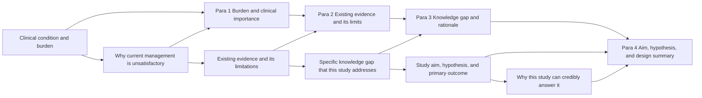

# Introduction Writing Guide (Medical Research)

## Goal

Write a strong Introduction in three steps:

1. Think through the introduction logic (clinical importance → knowledge gap → study aim).
2. Apply a suitable template below.
3. Revise the introduction repeatedly.

Most biomedical Introductions are **short** — typically 3 to 5 paragraphs and under 600 words. Reviewers expect: clinical importance, current evidence base and gap, the specific question this study answers, and a clear statement of aim and hypothesis.

## Introduction Logic Map



## How to Think About the Introduction: Backward First, Then Forward

### Backward reasoning (answer these first)

1. What is the specific clinical question, and why is it currently unresolved? (important)
2. What is our contribution: a new trial, a larger or better-controlled cohort, a new diagnostic, an updated synthesis, a new mechanistic insight, or a new metric?
3. What is the benefit of our study, why can it close the gap, and what new knowledge does it bring? (important)
4. How do we use prior evidence to bring readers from the disease burden to our specific aim?

### Forward story (write in this order)

1. Establish clinical importance and disease burden.
2. Use prior evidence to lead to the specific knowledge gap we address.
3. State the present study and its prespecified primary outcome.
4. State the hypothesis and the practical advantage of our design. (important)

## Three-Part Structure (Armağan 2013)

The Introduction divides cleanly into **three** parts. Following them in order keeps the reader moving from the general to the specific.

1. **General background.** Open with information on the broader topic in light of the current literature, written as if the reader is a non-specialist. Establish a "warm rapport" before plunging into the problem; readers asked to screen the literature themselves before reading your study will refrain from reading. Updated and robust references belong here.
2. **The specific problem.** Narrow to the precise issue your study addresses, with the fundamental references that frame it. Reduce to **one** problem; if there is more than one, the second one belongs in another paper. Multiple targets multiply solutions and confuse readers.
3. **Aim (the solution).** State your aim explicitly in the last paragraphs. Do not leave readers to infer it. "A clearly expressed solution to an explicitly revealed problem" is the integrity of the Introduction.

Other Introduction-specific reminders:

1. **Simple present tense** is the default for established knowledge in the Introduction; past tense for prior studies and for the present study's design (last paragraph).
2. **Define every abbreviation** at first use in the Introduction, even if the abstract already defined it (the abstract's definitions do not carry over).
3. **Avoid mysterious sentences and word play.** The reader expects efficient information transfer; rhetorical riddles produce non-readers.
4. **References should be recent and from high-impact sources** where possible; classics are fine for foundational claims.

## Aim vs. Objective — Distinguish Them

Many manuscripts use *aim* and *objective* interchangeably. They are not the same; reviewers and editors notice when they are conflated.

| Term | Question it answers | Example |
| --- | --- | --- |
| **Aim** | What did we want to do? | "We aimed to estimate the effect of dapagliflozin on cardiovascular events in HFpEF." |
| **Objective** | What did we have to do to achieve the aim? | "Our primary objective was to compare the rate of cardiovascular death or heart-failure hospitalization at 24 months between treatment arms." |

A study has typically **one aim** and **one or more objectives**. State the aim in the last paragraph of the Introduction; objectives can appear in the Introduction (briefly) or in the Methods.

## The IaMRDC Acronym (Mondal et al. 2019)

The conventional structure for an original article is **IMRaD** — Introduction, Methods, Results, Discussion. Mondal et al. propose the more granular acronym **IaMRDC**, which separates *aim* and *Conclusion* explicitly:

| Section | Question it answers | Suggestion |
| --- | --- | --- |
| Title | The whole article in a few words | Short and catchy |
| Abstract | The whole article in a nutshell | Most important point of each section |
| Keywords | Important terms | Use MeSH terms |
| Introduction / background | Why did we conduct the study? | Precise purpose |
| **Aim** | What did we want to do? | Be specific |
| **Objective** | What did we have to do? | Distinguish from aim |
| Materials and methods | How did we do it? | Every minute detail |
| Results | What did we find? | Proper sequence |
| Discussion | What does the finding mean? | New, important, interesting; compare with literature |
| **Conclusion** | What is the new understanding? | Do not write beyond the scope of the study |

Many journal readers read the **aim** and the **conclusion** first to decide whether to read the rest; both deserve disproportionate care.

## Section Skeleton

```
Introduction
% Paragraph 1: Clinical importance and burden of the condition.
% Paragraph 2: Current management and the most relevant prior evidence.
% Paragraph 3: Specific limitation of prior evidence (the knowledge gap).
% Paragraph 4: Aim, hypothesis, design (one sentence), and primary outcome.
```

## Part A: Establish Clinical Importance and the Question

### Version 1 — Niche condition: define the entity, then the burden

`Use when the condition, exposure, or population is unfamiliar to a general medical audience.`

Writing structure:

1. Define the entity in one clear sentence (what it is, who is affected).
2. Briefly state burden (incidence/prevalence, mortality, disability, cost).
3. Briefly state the clinical management context.

Sentence skeletons:

1. `[Condition] is [definition].`
2. `[Condition] affects approximately [N] per 100,000 person-years and is associated with [burden].`
3. `Current management relies on [standard of care], which [achieves / fails at] [outcome].`

Local cite: `references/examples/introduction/version-1-task-then-application.md`.

### Version 2 — Familiar condition: lead with burden

`Use when the condition (e.g., type 2 diabetes, ischaemic stroke, breast cancer) is well known to the audience.`

Writing structure:

1. Skip the formal definition.
2. Open with the burden or the clinical decision at stake.
3. Optionally append the unmet target (e.g., residual mortality, recurrence, quality of life).

Sentence skeleton:

1. `[Condition] is a leading cause of [outcome] worldwide and accounts for [statistic].`

Local cite: `references/examples/introduction/version-2-application-first.md`.

### Version 3 — General problem, then specific clinical setting

`Use when the broad problem is well known but your study addresses a specific population or setting (e.g., elderly, low-resource, post-transplant).`

Writing structure:

1. Open with the general burden.
2. Narrow down to the specific population or setting.
3. Clarify exactly which patients, exposures, and outcomes are in scope.

Sentence skeleton:

1. `[Condition] is associated with [burden] across populations.`
2. `This study focuses on [specific population] in [setting], where [special consideration] makes the existing evidence base inadequate.`

Local cite: `references/examples/introduction/version-3-general-to-specific-setting.md`.

### Version 4 — Open with burden and immediately expose the gap

`Use when the field is moving fast and the unresolved question can be stated alongside the burden in the opening paragraph.`

Writing structure:

1. Start with importance.
2. Immediately summarize how prior trials/cohorts approached the problem.
3. Immediately expose the unresolved question and the methodological reason.
4. Use this opening as a bridge to the subsequent prior-evidence paragraph.

Opening-paragraph skeleton:

1. `[Importance sentence].`
2. `Previous [trials / cohorts / reviews] have shown [finding], but ...`
3. `Whether [specific question] remains unanswered because ...`

Expert note:

1. Stating the unresolved question in paragraph 1 is powerful but only works when the field has a clearly accepted shared baseline.
2. More commonly, paragraph 2 or 3 introduces the gap.

Local cite: `references/examples/introduction/version-4-open-with-challenge.md`.

## Part B: Establish the Knowledge Gap (Very Important)

Purpose:

1. Discuss precisely the gap that this study fills.
2. Build reader curiosity about whether and how the question can be answered.
3. Make the rationale of our design self-evident.

Logic before writing:

1. First make clear the chain: burden → prior evidence → limitation → our specific question.
2. For an existing question with prior trials/cohorts: identify which evidence has the limitation, why it has the limitation, and what specifically is unresolved.
3. For a new clinical question: at minimum, define the question and why the existing evidence base does not address it.

Important warning:

1. Do not first present a strawman prior study and then describe your improvement over it. Reviewers and clinicians read this as score-padding.
2. Even if your study is incremental, frame it through the unresolved clinical question, not through "Smith 2023 was small".
3. Avoid statements such as "no study has ever..." unless you have actually verified that with a recent systematic search.

### Gap Version 1 — Established question with multiple prior studies

`Use when there is a clear chain: foundational studies → recent trials/cohorts → remaining gap.`

Writing structure:

1. Start with what is established (the consensus or guideline-level statement).
2. Briefly summarize the most relevant prior study or systematic review and its limitation.
3. Briefly summarize a more recent or contradictory study and its limitation with a methodological reason (small sample, short follow-up, non-representative population, residual confounding, surrogate outcome).
4. Ensure the final unresolved item is exactly the question your study addresses.

Sentence skeletons:

1. `It is established that [consensus statement; cite guideline or seminal trial].`
2. `However, the [LIMITATION-A] of these studies leaves [SPECIFIC QUESTION] unresolved because [METHODOLOGICAL REASON].`
3. `More recent [trials / cohorts] have suggested [FINDING], but [LIMITATION-B] limits their applicability to [POPULATION / SETTING].`

Local cite: `references/examples/introduction/technical-challenge-version-1-existing-task.md`.

### Gap Version 2 — Existing question; the older literature already hints at our hypothesis

`Use when the design or hypothesis was foreshadowed by an older mechanistic or observational line of work.`

Writing structure:

1. Start from mainstream methods/findings and state their limitation.
2. Introduce the older line of evidence that prefigures your hypothesis.
3. Explain why that older line is still insufficient on its own.
4. Return to recent evidence and show what remains unresolved.
5. Bridge to your study naturally.

Sentence skeletons:

1. `Recent [trials / cohorts] suggest ... However, they ... because ...`
2. `An older line of [mechanistic / observational] evidence already raised the possibility that [HYPOTHESIS], but those studies [LIMITATION].`
3. `Whether [HYPOTHESIS] holds in [POPULATION / SETTING] when tested with [DESIGN] is still unknown.`

Local cite: `references/examples/introduction/technical-challenge-version-2-existing-task-insight-backed-by-traditional.md`.

### Gap Version 3 — Novel clinical question, no direct prior studies

`Use when the question is new (a newly recognized syndrome, a new diagnostic, a recent regulatory change) and prior evidence is indirect.`

Writing structure:

1. State the goal and explain why the question is challenging for N reasons.
2. Use `First / Second / Finally` to separate independent challenges.
3. For each, state the observable difficulty and the methodological/clinical reason.
4. End with a transition to your study.

Sentence skeletons:

1. `In this study, our aim is to [AIM]. This question is challenging for three reasons.`
2. `First, ...`
3. `Second, ...`
4. `Finally, ...`

Local cite: `references/examples/introduction/technical-challenge-version-3-novel-task.md`.

## Part C: Aim, Hypothesis, and Design — How to Close the Introduction

Key questions before writing:

### For confirmatory studies (RCTs, prespecified analyses)

1. What is the prespecified primary outcome and analysis population?
2. What is the directional hypothesis (superiority, noninferiority, equivalence)?
3. Why is this design appropriate to answer the question?
4. What is the practical advantage over prior designs?

### For exploratory or descriptive studies

1. What is the descriptive aim?
2. What hypotheses (if any) are explored, and labeled as such?
3. Why is this dataset / population / method appropriate?

### Design Version 1 — One contribution with multiple advantages

`Use when one core design choice carries the paper.`

Writing structure:

1. State the present study in one sentence (design + population + intervention/exposure + outcome).
2. Point to the trial profile or study flow figure.
3. State the key methodological strength in one sentence.
4. Briefly state implementation (registration, preregistration, blinding, follow-up duration).
5. State 1–2 specific advantages over prior evidence.

Sentence skeletons:

1. `In this [study type], we [aim] in [population] using [design].`
2. `The trial profile is shown in [Figure 1].`
3. `Our innovation is [METHODOLOGICAL STRENGTH].`
4. `Specifically, we [DETAIL: blinding / registry / outcome ascertainment / analysis plan].`
5. `In contrast to prior [studies], this design allows us to [ADVANTAGE].`

Local cite: `references/examples/introduction/pipeline-version-1-one-contribution-multi-advantages.md`.

### Design Version 2 — Two contributions

`Use when the paper makes two prespecified contributions (e.g., efficacy plus a safety contribution; or pooled effect plus a heterogeneity contribution).`

Writing structure:

1. State the study and its overarching aim.
2. State the key methodological strength.
3. Point to the figure.
4. Explain contribution 1 and its advantage.
5. Introduce the remaining unresolved sub-question.
6. Explain contribution 2 as the response.

Local cite: `references/examples/introduction/pipeline-version-2-two-contributions.md`.

### Design Version 3 — New analytic step on an established design

`Use when you take a familiar design (e.g., a cohort, a meta-analysis) and add one new analytic component (e.g., target trial emulation, individual participant data, network meta-analysis, sensitivity analysis with E-values).`

Writing structure:

1. Start from the established design.
2. Introduce the new analytic component as the key contribution.
3. Provide the observation or methodological insight that motivates it.
4. Explain how the component changes the inference.
5. Compare against the conventional analysis and state why this is more credible.

Local cite: `references/examples/introduction/pipeline-version-3-new-module-on-existing-pipeline.md`.

### Design Version 4 — Observation-driven contribution

`Use when the contribution comes from one striking observation or pilot finding that the present study confirms in a definitive design.`

Writing structure:

1. State the key methodological or biological insight first.
2. Briefly state the observation that motivates it (a pilot signal, a registry trend, a mechanistic finding).
3. Briefly state the present study that tests it.
4. State the expected practical impact.

Local cite: `references/examples/introduction/pipeline-version-4-observation-driven.md`.

### Not Recommended Pattern

`Not recommended: present only an abstract conceptual frame in the Introduction without naming the design, population, primary outcome, or hypothesis.`

Why it fails reviewers:

1. The reader cannot tell whether the study is confirmatory or exploratory.
2. Important elements (registration, blinding, follow-up) are hidden until Methods, which delays trust.
3. The Discussion ends up making claims that the design cannot support.

Local cite: `references/examples/introduction/pipeline-not-recommended-abstract-only.md`.

## Example Bank

1. `references/examples/introduction-examples.md`
2. `references/examples/introduction/version-1-task-then-application.md`
3. `references/examples/introduction/version-2-application-first.md`
4. `references/examples/introduction/version-3-general-to-specific-setting.md`
5. `references/examples/introduction/version-4-open-with-challenge.md`
6. `references/examples/introduction/technical-challenge-version-1-existing-task.md`
7. `references/examples/introduction/technical-challenge-version-2-existing-task-insight-backed-by-traditional.md`
8. `references/examples/introduction/technical-challenge-version-3-novel-task.md`
9. `references/examples/introduction/pipeline-version-1-one-contribution-multi-advantages.md`
10. `references/examples/introduction/pipeline-version-2-two-contributions.md`
11. `references/examples/introduction/pipeline-version-3-new-module-on-existing-pipeline.md`
12. `references/examples/introduction/pipeline-version-4-observation-driven.md`
13. `references/examples/introduction/pipeline-not-recommended-abstract-only.md`
14. `references/examples/introduction/novel-task-challenge-decomposition.md`

## See Also

1. **Drafting order** (write Introduction after Methods and Results): `references/writing-process.md`.
2. **Background literature framing** (when the literature framing extends into a separate section or becomes the body of a narrative review): `references/related-work.md`.
3. **Sentence- and word-level revision** (concise prose, calibrated hedging, anthropomorphism): `references/scientific-writing-principles.md`.
4. **Pre-submission review of the Introduction** (the gap statement is among the most-checked items): `references/paper-review.md`.

## Quick Quality Checklist

1. Does the first sentence of each paragraph state its message?
2. Does each paragraph carry one message only?
3. Are clinical importance, knowledge gap, aim, and hypothesis all explicit and in this order?
4. Is the primary outcome named in the Introduction (or, at minimum, by the last sentence)?
5. Are claims in the Introduction consistent with the analyses actually reported in the Results?
6. Is terminology stable across all sections (intervention name, exposure definition, outcome definition)?
7. Is causal language calibrated to the design?
