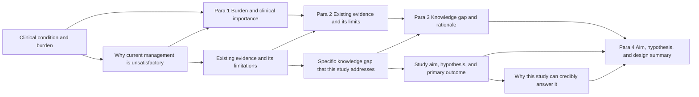

# Introduction Writing Guide (Medical Research)

## Goal

Write a strong Introduction in three steps:

1. Think through the introduction logic (clinical importance → knowledge gap → study aim).
2. Apply a suitable template below.
3. Revise the introduction repeatedly.

Most biomedical Introductions are **short**: typically 3 to 5 paragraphs and under 600 words. Reviewers expect: clinical importance, current evidence base and gap, the specific question this study answers, and a clear statement of aim and hypothesis.

## Introduction Logic Map


```mermaid
graph LR
  L1[Clinical condition and burden]
  L2[Why current management is unsatisfactory]
  L3[Existing evidence and its limitations]
  L4[Specific knowledge gap that this study addresses]
  L5[Study aim, hypothesis, and primary outcome]
  L6[Why this study can credibly answer it]

  R1[Para 1 Burden and clinical importance]
  R2[Para 2 Existing evidence and its limits]
  R3[Para 3 Knowledge gap and rationale]
  R4[Para 4 Aim, hypothesis, and design summary]

  L1 --> L2
  L2 --> L3
  L3 --> L4
  L4 --> L5
  L5 --> L6

  R1 --> R2
  R2 --> R3
  R3 --> R4

  L1 --> R1
  L2 --> R1
  L3 --> R2
  L4 --> R3
  L5 --> R4
  L6 --> R4
```

## How to Think About the Introduction: Backward First, Then Forward

### Backward reasoning (answer these first)

1. What is the specific clinical question, and why is it currently unresolved? (important)
2. What kind of gap is it: evidence absent, conflicting, from another population, of low certainty, about a new condition or test, or visible as unexplained practice variation? (See the selector in Part B.)
3. Which feature of our design (randomization, population, comparator, outcome, follow-up, bias-removing analysis) closes that gap, and what clinical decision will the answer inform? (important)
4. How do we use prior evidence to bring readers from the disease burden to our specific aim?

### Forward story (write in this order)

1. Establish clinical importance and disease burden.
2. Use prior evidence to lead to the specific knowledge gap we address.
3. State the present study and its prespecified primary outcome.
4. State the hypothesis and the design feature that fixes the weakness of prior evidence. (important)

## Three-Part Structure (Armağan 2013)

The Introduction divides cleanly into **three** parts. Following them in order keeps the reader moving from the general to the specific.

1. **General background.** Open with information on the broader topic in light of the current literature, written as if the reader is a non-specialist. Establish a "warm rapport" before plunging into the problem; readers asked to screen the literature themselves before reading your study will refrain from reading. Updated and robust references belong here.
2. **The specific problem.** Narrow to the precise issue your study addresses, with the fundamental references that frame it. Reduce to **one** problem; if there is more than one, the second one belongs in another paper. Multiple targets multiply solutions and confuse readers.
3. **Aim (the solution).** State your aim explicitly in the last paragraphs. Do not leave readers to infer it. "A clearly expressed solution to an explicitly revealed problem" is the integrity of the Introduction.

Other Introduction-specific reminders:

1. **Simple present tense** is the default for established knowledge in the Introduction; past tense for prior studies and for the present study's design (last paragraph).
2. **Define every abbreviation** at first use in the Introduction, even if the abstract already defined it (the abstract's definitions do not carry over).
3. **Avoid mysterious sentences and word play.** The reader expects efficient information transfer; rhetorical riddles produce non-readers.
4. **References should be recent and from high-impact sources** where possible; classics are fine for foundational claims.

## Aim vs. Objective: Distinguish Them

Many manuscripts use *aim* and *objective* interchangeably. They are not the same; reviewers and editors notice when they are conflated.

| Term | Question it answers | Example |
| --- | --- | --- |
| **Aim** | What did we want to do? | "We aimed to estimate the effect of dapagliflozin on cardiovascular events in HFpEF." |
| **Objective** | What did we have to do to achieve the aim? | "Our primary objective was to compare the rate of cardiovascular death or heart-failure hospitalization at 24 months between treatment arms." |

A study has typically **one aim** and **one or more objectives**. State the aim in the last paragraph of the Introduction; objectives can appear in the Introduction (briefly) or in the Methods.

## The IaMRDC Acronym (Mondal et al. 2019)

The conventional structure for an original article is **IMRaD**: Introduction, Methods, Results, Discussion. Mondal et al. propose the more granular acronym **IaMRDC**, which separates *aim* and *Conclusion* explicitly:

| Section | Question it answers | Suggestion |
| --- | --- | --- |
| Title | The whole article in a few words | Short and catchy |
| Abstract | The whole article in a nutshell | Most important point of each section |
| Keywords | Important terms | Use MeSH terms |
| Introduction / background | Why did we conduct the study? | Precise purpose |
| **Aim** | What did we want to do? | Be specific |
| **Objective** | What did we have to do? | Distinguish from aim |
| Materials and methods | How did we do it? | Every minute detail |
| Results | What did we find? | Proper sequence |
| Discussion | What does the finding mean? | New, important, interesting; compare with literature |
| **Conclusion** | What is the new understanding? | Do not write beyond the scope of the study |

Many journal readers read the **aim** and the **conclusion** first to decide whether to read the rest; both deserve disproportionate care.

## Section Skeleton

```
Introduction
% Paragraph 1: Clinical importance and burden of the condition.
% Paragraph 2: Current management and the most relevant prior evidence.
% Paragraph 3: Specific limitation of prior evidence (the knowledge gap).
% Paragraph 4: Aim, hypothesis, design (one sentence), and primary outcome.
```

## Part A: Establish Clinical Importance and the Question

### Version 1: Niche condition: define the entity, then the burden

`Use when the condition, exposure, or population is unfamiliar to a general medical audience.`

Writing structure:

1. Define the entity in one clear sentence (what it is, who is affected).
2. Briefly state burden (incidence/prevalence, mortality, disability, cost).
3. Briefly state the clinical management context.

Sentence skeletons:

1. `[Condition] is [definition].`
2. `[Condition] affects approximately [N] per 100,000 person-years and is associated with [burden].`
3. `Current management relies on [standard of care], which [achieves / fails at] [outcome].`

Local cite: `references/examples/introduction/opening-define-entity-then-burden.md`.

### Version 2: Familiar condition: lead with burden

`Use when the condition (e.g., type 2 diabetes, ischaemic stroke, breast cancer) is well known to the audience.`

Writing structure:

1. Skip the formal definition.
2. Open with the burden or the clinical decision at stake.
3. Optionally append the unmet target (e.g., residual mortality, recurrence, quality of life).

Sentence skeleton:

1. `[Condition] is a leading cause of [outcome] worldwide and accounts for [statistic].`

Local cite: `references/examples/introduction/opening-lead-with-burden.md`.

### Version 3: General problem, then specific clinical setting

`Use when the broad problem is well known but your study addresses a specific population or setting (e.g., elderly, low-resource, post-transplant).`

Writing structure:

1. Open with the general burden.
2. Narrow down to the specific population or setting.
3. Clarify exactly which patients, exposures, and outcomes are in scope.

Sentence skeleton:

1. `[Condition] is associated with [burden] across populations.`
2. `This study focuses on [specific population] in [setting], where [special consideration] makes the existing evidence base inadequate.`

Local cite: `references/examples/introduction/opening-general-to-specific-setting.md`.

### Version 4: Open with burden and immediately expose the gap

`Use when the field is moving fast and the unresolved question can be stated alongside the burden in the opening paragraph.`

Writing structure:

1. Start with importance.
2. Immediately summarize how prior trials/cohorts approached the problem.
3. Immediately expose the unresolved question and the methodological reason.
4. Use this opening as a bridge to the subsequent prior-evidence paragraph.

Opening-paragraph skeleton:

1. `[Importance sentence].`
2. `Previous [trials / cohorts / reviews] have shown [finding], but ...`
3. `Whether [specific question] remains unanswered because ...`

Expert note:

1. Stating the unresolved question in paragraph 1 is powerful but only works when the field has a clearly accepted shared baseline.
2. More commonly, paragraph 2 or 3 introduces the gap.

Local cite: `references/examples/introduction/opening-burden-with-immediate-gap.md`.

## Part B: Establish the Knowledge Gap (Very Important)

Purpose:

1. Discuss precisely the gap that this study fills.
2. Build reader curiosity about whether and how the question can be answered.
3. Make the rationale of our design self-evident.

Logic before writing:

1. First make clear the chain: burden → prior evidence → limitation → our specific question.
2. For an existing question with prior trials/cohorts: identify which evidence has the limitation, why it has the limitation, and what specifically is unresolved.
3. For a new clinical question: at minimum, define the question and why the existing evidence base does not address it.

Important warning:

1. Do not first present a strawman prior study and then describe your improvement over it. Reviewers read this as self-promotion rather than a clinical rationale.
2. Even if your study is incremental, frame it through the unresolved clinical question, not through "Smith 2023 was small".
3. Avoid statements such as "no study has ever..." unless you have actually verified that with a recent systematic search.

### Choose the gap by type

Name the type of gap before writing; each type needs different evidence in the paragraph and implies a different design in the closing paragraph.

| Gap type | What the paragraph must show | Design it usually implies | Example file |
| --- | --- | --- | --- |
| Evidence absent | The clinical decision at stake, the indirect evidence available, and a documented search showing no direct studies | Any confirmatory design; often a first trial or a well-controlled cohort | `gap-evidence-absent.md` |
| Evidence conflicting | What is established, what the studies found, and **why** they disagree | A design that removes the reason for disagreement (size, dose, timing, bias) | `gap-conflicting-evidence.md` |
| Evidence from another population or setting | Who was excluded from the main evidence and a concrete reason the effect may differ there | Study in the excluded population; effect-modification analysis | `gap-evidence-from-other-population.md` |
| Evidence of low certainty | The mechanism of uncertainty (confounding, imprecision, surrogate outcome, bias), ideally with a GRADE rating from a review or guideline | Randomization, adequate power, patient-important outcome, longer follow-up | `gap-low-certainty-evidence.md` |
| New condition, test, or technology | Why the entity is new, what is known, and the obstacles a credible study must overcome (definition, comparator, follow-up) | Inception cohort, diagnostic accuracy study, early-phase trial | `gap-new-condition-test-or-technology.md` |
| Existing tools perform poorly | Named scores or tests and the measurable way they fail (calibration, sensitivity, missing inputs) | Model development, updating, or external validation (TRIPOD+AI); accuracy study (STARD) | `gap-existing-tools-inadequate.md` |
| Unexplained practice variation | Quantified variation, not explained by case mix, with guidelines silent for lack of evidence | Pragmatic, cluster, or registry-based randomized trial; comparative effectiveness cohort | `gap-practice-variation.md` |

All files are in `references/examples/introduction/`.

### Writing the gap paragraph (applies to every type)

Writing structure:

1. Start with what is established (the consensus or guideline-level statement), with verified citations.
2. Summarize the most relevant prior evidence and name its specific limitation with a methodological reason (small sample, short follow-up, non-representative population, residual confounding, surrogate outcome).
3. If studies conflict, say why they conflict.
4. End with one sentence stating the unresolved question in PICO/PECO terms; it must be exactly the question your study answers.

Sentence skeletons:

1. `It is established that [consensus statement; cite guideline or seminal trial].`
2. `However, the [LIMITATION-A] of these studies leaves [SPECIFIC QUESTION] unresolved because [METHODOLOGICAL REASON].`
3. `More recent [trials / cohorts] have suggested [FINDING], but [LIMITATION-B] limits their applicability to [POPULATION / SETTING].`
4. `Whether [INTERVENTION / EXPOSURE] [changes] [OUTCOME] in [POPULATION] therefore remains unknown.`

For a genuinely new condition, test, or technology, replace steps 1 to 3 with: what the entity is and why it matters now, what is known, and at most three obstacles a credible study must overcome (`First / Second / Finally`). Each obstacle must be answered by a specific choice in the Methods.

## Part C: Aim, Hypothesis, and Design: How to Close the Introduction

Key questions before writing:

### For confirmatory studies (RCTs, prespecified analyses)

1. What is the prespecified primary outcome and analysis population?
2. What is the directional hypothesis (superiority, noninferiority, equivalence)?
3. Why is this design appropriate to answer the question?
4. Which weakness of prior evidence does the design fix?

### For exploratory or descriptive studies

1. What is the descriptive aim?
2. What hypotheses (if any) are explored, and labeled as such?
3. Why is this dataset / population / method appropriate?

### Choose the closing pattern

| Situation | Closing pattern | Example file |
| --- | --- | --- |
| Default confirmatory study | Aim (PICO/PECO) → hypothesis → the design feature that fixes the weakness named in the gap | `closing-aim-hypothesis-design.md` |
| Two prespecified questions (efficacy plus safety; pooled effect plus heterogeneity) | Primary aim → concern that motivates the second question → how it was prespecified | `closing-primary-and-key-safety-question.md` |
| Observational study whose strength is removing a known bias | Bias in prior analyses → design that removes it → aim stated as an estimand | `closing-design-addresses-known-bias.md` |
| Study prompted by a pilot, case series, or registry signal | Prior signal → why it is insufficient → the stronger design → proportionate stakes | `closing-testing-a-prior-signal.md` |

Writing structure (all patterns):

1. State the aim as the answer to the gap, in one sentence: design, population, intervention or exposure, comparator, primary outcome, timepoint.
2. State the hypothesis, with its direction (and superiority, noninferiority, or equivalence for trials); for exploratory studies, say that the analysis is exploratory.
3. Justify the design by the specific weakness of prior evidence it fixes.
4. Keep it to one paragraph; registration, randomization details, and analysis populations belong in the Methods.

Sentence skeletons:

1. `We therefore conducted a [DESIGN] to assess whether [INTERVENTION], compared with [COMPARATOR], [changes] [PRIMARY OUTCOME] at [TIMEPOINT] in [POPULATION].`
2. `We hypothesized that [INTERVENTION] would [DIRECTION] [PRIMARY OUTCOME].`
3. `Unlike [PRIOR EVIDENCE], this [DESIGN FEATURE] addresses [SPECIFIC WEAKNESS].`

Avoid self-description ("our innovation", "novel", "for the first time", "our contribution"). A reviewer can verify a design feature and the bias it removes; they cannot verify novelty.

### Not recommended patterns

Six patterns reviewers penalize, each with a better alternative: abstract conceptual closing without a design, self-description instead of justification, unverified "no study has ever" claims, vague gaps, an aim that does not match the gap, and strawman prior studies.

Local cite: `references/examples/introduction/not-recommended-patterns.md`.

## Example Bank

1. `references/examples/introduction-examples.md` (index)
2. Opening: `opening-define-entity-then-burden.md`, `opening-lead-with-burden.md`, `opening-general-to-specific-setting.md`, `opening-burden-with-immediate-gap.md`
3. Gap by type: `gap-evidence-absent.md`, `gap-conflicting-evidence.md`, `gap-evidence-from-other-population.md`, `gap-low-certainty-evidence.md`, `gap-new-condition-test-or-technology.md`, `gap-existing-tools-inadequate.md`, `gap-practice-variation.md`
4. Closing: `closing-aim-hypothesis-design.md`, `closing-primary-and-key-safety-question.md`, `closing-design-addresses-known-bias.md`, `closing-testing-a-prior-signal.md`
5. Anti-patterns: `not-recommended-patterns.md`

All files in items 2 to 5 are in `references/examples/introduction/`.

## See Also

1. **Drafting order** (write Introduction after Methods and Results): `references/writing-process.md`.
2. **Background literature framing** (when the literature framing extends into a separate section or becomes the body of a narrative review): `references/related-work.md`.
3. **Sentence- and word-level revision** (concise prose, calibrated hedging, anthropomorphism): `references/scientific-writing-principles.md`.
4. **Pre-submission review of the Introduction** (the gap statement is among the most-checked items): `references/paper-review.md`.

## Quick Quality Checklist

1. Does the first sentence of each paragraph state its message?
2. Does each paragraph carry one message only?
3. Are clinical importance, knowledge gap, aim, and hypothesis all explicit and in this order?
4. Is the primary outcome named in the Introduction (or, at minimum, by the last sentence)?
5. Are claims in the Introduction consistent with the analyses actually reported in the Results?
6. Is terminology stable across all sections (intervention name, exposure definition, outcome definition)?
7. Is causal language calibrated to the design?
