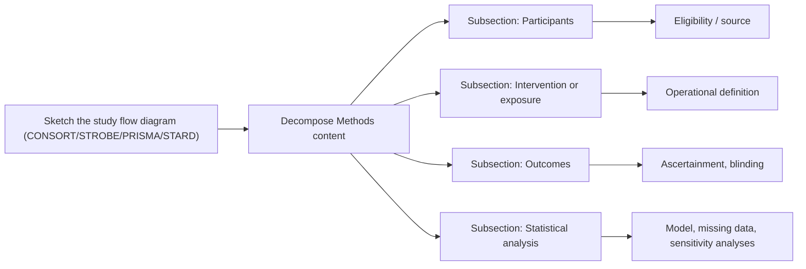
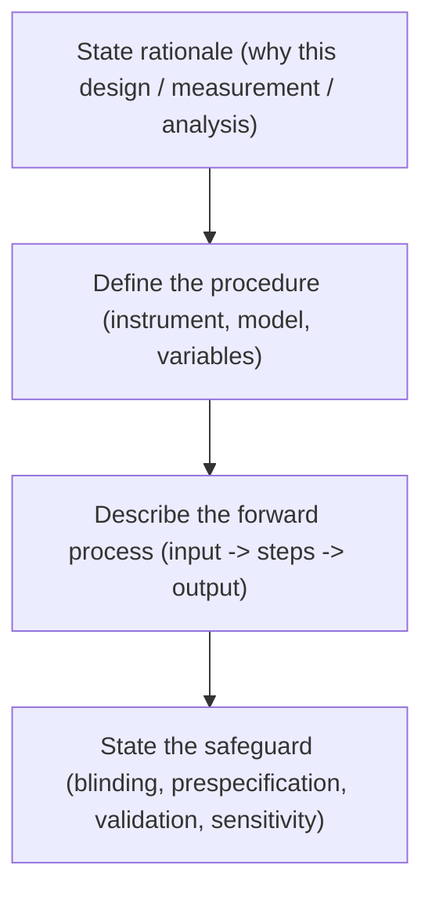

# Methods Writing Guide (Medical Research)

## Goal

Write a Methods section that another competent investigator could use to reproduce the study, and that a reviewer can map item-by-item to the relevant reporting standard (CONSORT, STROBE, PRISMA, STARD).

Sequence:

1. Identify the study type and pull the matching reporting checklist (`references/reporting-standards.md`).
2. Answer the pre-writing questions below.
3. Sketch the study flow diagram (CONSORT flow, STROBE flow, PRISMA flow, or STARD flow).
4. Write the Methods subsections in the recommended order for the study type.

## Pre-Writing Questions

Before writing Methods, answer in plain language:

1. **Design.** What is the study design (RCT — parallel / crossover / cluster / factorial; cohort — prospective / retrospective; case-control; cross-sectional; diagnostic accuracy; systematic review / meta-analysis), and was it preregistered?
2. **Setting.** Where, when, and over what dates were participants recruited or data collected?
3. **Participants.** What are the eligibility criteria (inclusion + exclusion)? How were participants identified, recruited, and consented?
4. **Intervention or exposure.** Exactly what was administered, by whom, in what dose / schedule, with what comparator?
5. **Outcomes.** What is the prespecified primary outcome? Secondary outcomes? Adverse events? How and when were they ascertained?
6. **Sample size.** How was sample size determined, with what assumptions (effect size, power, alpha, dropout)?
7. **Allocation, blinding, and bias control.** Randomization method, allocation concealment, blinding of participants / clinicians / outcome assessors / analysts, and any bias-control strategy.
8. **Statistical analysis.** Analysis population (intention-to-treat / per-protocol / modified ITT), primary analysis, handling of missing data, multiplicity adjustments, sensitivity analyses, prespecified subgroups.
9. **Ethics.** IRB / ethics committee approval, consent, registration number, data sharing.

Organize the answers as a table or mind map before writing prose.

## Methods Section Order (by Study Type)

### Randomized controlled trial (CONSORT)

```
Methods
% Trial design
% Participants (setting, eligibility, recruitment, consent)
% Interventions (intervention and comparator, dose, schedule, adherence monitoring)
% Outcomes (primary, secondary, adverse events, ascertainment)
% Sample size
% Randomization and blinding (sequence generation, allocation concealment, blinding of who)
% Statistical methods (analysis population, primary analysis, handling of missing data, sensitivity analyses, subgroups, software)
% Ethics, registration, funding role
```

### Observational study (STROBE)

```
Methods
% Study design (cohort / case-control / cross-sectional)
% Setting and period
% Participants (eligibility, sources, methods of selection, follow-up)
% Variables (exposure, outcome, confounders, effect modifiers; operational definitions)
% Data sources / measurement (and any validation of measurement)
% Bias (how the study addressed selection, information, and confounding bias)
% Study size
% Quantitative variables (handling, categorization)
% Statistical methods (model, confounder adjustment, missing data, sensitivity analyses, subgroups)
% Ethics
```

### Diagnostic accuracy study (STARD)

```
Methods
% Study design (cross-sectional, cohort, case-control)
% Participants (eligibility, sampling, consecutive vs. selected enrollment)
% Index test (description, who performed it, blinding, threshold definition)
% Reference standard (description, blinding, time interval to index test)
% Test methods and analysis (handling of indeterminate results)
% Sample size
% Statistical methods (sensitivity, specificity, predictive values, AUC, 95% CIs, subgroup analyses)
% Ethics
```

### Systematic review / meta-analysis (PRISMA)

```
Methods
% Protocol and registration (PROSPERO)
% Eligibility criteria (PICO/PECO + study designs, languages, dates)
% Information sources and search dates
% Search strategy (full strategy in supplement; example for one database in main text)
% Selection process (number of reviewers, blinding, software)
% Data collection process and items
% Risk-of-bias assessment (tool used; e.g., RoB 2, ROBINS-I, QUADAS-2, Newcastle-Ottawa)
% Effect measures
% Synthesis methods (qualitative summary, pooled estimate, model, heterogeneity, subgroup, sensitivity)
% Reporting bias assessment (funnel plot, statistical tests)
% Certainty of evidence (GRADE)
```

## Why Methods Is the Most Important Section

The Methods section is where the **validity of the study is judged**. Reviewers, readers, and editorial committees decide whether to trust the Results based on how Methods is written. The two questions Methods must answer:

1. Could a competent investigator **replicate the study** from this section alone?
2. Can the reader **judge whether the results and conclusions are valid**, given the design and execution described here?

If either question is answered "no", the Methods section is incomplete.

## Writing Style — Direct, Precise, Past Tense

1. **Past tense throughout.** "We randomized ...", "Outcomes were ascertained ...". Methods describes what was done.
2. **Direct sentences.** Avoid compound sentences and hedging.
3. **Most important first within each subsection.** Within Participants, lead with the population definition; within Outcomes, lead with the prespecified primary outcome.
4. **Chronological order for procedures.** When describing preparations, measurements, and the protocol, follow the actual sequence of execution.
5. **Subsections by topic when detail is dense.** Use named subsections (Participants, Intervention, Outcomes, Statistical Analysis) rather than running prose.
6. **No unimportant detail.** "We measured serum sodium" is enough; do not specify the brand of the venipuncture needle.

## Internal vs. External Validity — What Methods Defends

A clear Methods section addresses both:

1. **Internal validity.** Did the design and execution control bias well enough that the observed effect can be attributed to the intervention or exposure rather than to confounding, measurement error, or selection?
2. **External validity.** Can the result be generalized beyond the studied population, setting, and time period?

Methods establishes internal validity through design choices (randomization, blinding, prespecification, validated outcomes) and external validity through population definition (eligibility criteria, recruitment setting, time period).

## Purpose-Procedure Format (Kallet 2004)

When the rationale for a procedure is not obvious, state the purpose alongside the procedure. This is especially important when writing for a general medical audience rather than a subspecialty.

Examples:

1. `To control for diurnal variation in cortisol, blood samples were drawn between 07:00 and 09:00.`
2. `To assess proportional hazards, we tested the Schoenfeld residuals for each covariate.`
3. `To minimize observer bias, all radiographs were read by two radiologists blinded to treatment assignment.`
4. `Adequate intravascular volume was defined as a central venous pressure of at least 8 mm Hg.`

The purpose-procedure format prevents reviewers from asking "why did they do that?".

## Three Elements of Each Methods Subsection

Adapted from the original methods-writing framework, each subsection should make three things explicit:

### 1) What was done (the design / forward process)

1. Describe the design or procedure step by step in execution order.
2. For interventions: specify dose, route, schedule, and duration.
3. For measurements: specify instrument, units, timing, and who performed the measurement.
4. For analysis: specify the model, the variables, and the software (with version).

### 2) Why it was done that way (the rationale)

1. Tie the choice to the study aim or to a known source of bias.
2. Use problem-driven logic: because confounder X exists, we adjusted for it; because outcome Y is rare, we used Poisson regression.

### 3) Why it is credible (the safeguard)

1. State the bias-control mechanism: blinding, allocation concealment, prespecified analysis plan, validated instrument, blinded outcome adjudication, registry linkage.
2. Tie the safeguard to a measurable property when possible (e.g., kappa for inter-rater agreement, ICC for measurement repeatability).

Example local cite: `references/examples/method/example-of-the-three-elements.md`.

## Methods Content Decomposition



## How to Write Each Subsection

### Participants

`Make eligibility, source, and timing reproducible. Provide enough demographic and clinical context that the reader can judge external validity.`

Writing structure:

1. State the source population and the recruitment setting.
2. State inclusion criteria, then exclusion criteria.
3. State the recruitment and consent process.
4. State follow-up duration (cohorts, trials).
5. State the relevant health-status or severity descriptors so external validity can be judged.

For human studies, describe at minimum: age, sex, and (when relevant to the question) ethnicity. Add severity or health-status descriptors appropriate to the context — for example, NYHA class for heart failure, Glasgow Coma Scale for head injury, Charlson Comorbidity Index for general comorbidity, APACHE II or SAPS II for ICU populations, ECOG performance status for oncology, Sickness Impact Profile or SF-36 for rehabilitation studies, MMSE or MoCA for cognitive populations.

For animal studies, describe: species, strain, sex, weight, age at start of study, and supplier.

Sentence skeletons:

1. `Adults aged [X] years or older with [condition], confirmed by [diagnostic criterion], were eligible.`
2. `Patients were excluded if they had [contraindication / competing risk / pregnancy].`
3. `Participants were recruited consecutively at [N] [centers / clinics] in [country] between [date] and [date].`
4. `Severity at baseline was assessed with [validated scale]; the median [scale] score was [value] (IQR, [low] to [high]).`
5. `Written informed consent was obtained from all participants.`

### Intervention or Exposure

`Make the intervention or exposure operational.`

Writing structure:

1. Name the intervention or exposure precisely (active ingredient or generic name, not a brand).
2. State the dose / schedule / route / duration / responsible operator.
3. State the comparator with the same level of detail.
4. State adherence monitoring.

Sentence skeletons:

1. `Patients in the intervention group received [drug] [dose] [route] [schedule] for [duration].`
2. `The comparator group received [comparator] administered identically to maintain blinding.`
3. `Adherence was monitored by [pill count / electronic dispensing / self-report] at [timepoints].`

### Materials, Drugs, and Devices — Operational Specifics

When the intervention involves a drug, gas, biologic, or device, the Methods section must contain enough detail that another laboratory or hospital could reproduce it. Required elements:

1. **Drugs and biologics.** Generic name (not brand), manufacturer, concentration, dose, route, infusion rate, and duration.
2. **Medical gases.** Concentration and flow rate.
3. **Devices.** Manufacturer, model number, key settings, and software version.
4. **Assays and instruments.** Manufacturer, model, calibration procedure, units of measurement, and detection limits.
5. **Animal models.** Species, strain, weight range, sex, age, supplier, housing conditions, sedation and anesthesia protocol.
6. **Tissue preparations.** Source, processing pipeline, time from collection to analysis, storage conditions.
7. **Imaging.** Modality, sequence parameters, slice thickness, software for analysis, who interpreted, blinding.
8. **Validation of novel methods.** If the study introduces a new measurement or model, validation should ideally be published separately first; otherwise, the validation procedure must be described in detail and any sensitivity to inputs reported.

Sentence skeletons:

1. `Furosemide (Sanofi, Paris, France; concentration 10 mg/mL) was administered intravenously at 80 mg over 2 minutes, followed by a continuous infusion of 10 mg/h for 24 hours.`
2. `Oxygen was delivered at 2 L/min via nasal cannula, titrated to maintain peripheral saturation between 92 and 96%.`
3. `Cardiac MRI was performed on a 1.5-T scanner (Magnetom Avanto, Siemens Healthineers, Erlangen, Germany) using a 32-channel cardiac array, with steady-state free-precession cine sequences (TR 3.0 ms, TE 1.5 ms, slice thickness 8 mm).`
4. `Serum NT-proBNP was measured on the Elecsys 2010 platform (Roche Diagnostics, Indianapolis, IN, USA), with a manufacturer-specified detection limit of 5 pg/mL.`

For complex interventions, follow the TIDieR checklist (12 items: brief name, why, what materials, what procedures, who, how, where, when and how much, tailoring, modifications, planned/actual fidelity).

### Outcomes

`State the prespecified primary outcome first, exactly once.`

Writing structure:

1. State the prespecified primary outcome and its measurement timepoint.
2. State secondary outcomes.
3. State adverse events / safety outcomes.
4. State the ascertainment method, blinding of assessors, and adjudication.

Sentence skeletons:

1. `The primary outcome was [outcome], measured at [timepoint] using [instrument].`
2. `Secondary outcomes included [outcomes].`
3. `Outcomes were adjudicated by [N] independent assessors blinded to group assignment.`

### Sample Size

`Make the calculation reproducible.`

Writing structure:

1. State the assumed effect size and source.
2. State alpha (usually 0.05, two-sided) and power (usually 0.80 or 0.90).
3. State the calculation method and any inflation for dropout / clustering / multiplicity.

Sentence skeleton:

1. `Assuming an event rate of [X]% in the control arm and a relative risk reduction of [Y]%, a two-sided alpha of 0.05, and 80% power, [N] participants per arm were required. We inflated this to [N+inflation] to allow for [Z]% loss to follow-up.`

### Randomization and Blinding (RCTs only)

Writing structure:

1. State the randomization unit (individual / cluster), the ratio, and the block / strata.
2. State the sequence-generation method (computer-generated).
3. State allocation concealment (centralized service, sealed envelopes, etc.).
4. State who was blinded (participants, clinicians, outcome assessors, analysts).

### Statistical Analysis

Writing structure:

1. State the analysis population (ITT, modified ITT, per-protocol).
2. State the primary analysis (model, key covariates, effect measure, CI).
3. State handling of missing data (mechanism assumed, imputation method).
4. State multiplicity adjustment if applicable.
5. State prespecified sensitivity analyses and subgroup analyses; mark exploratory analyses as such.
6. State the software and version.

Sentence skeletons:

1. `The primary analysis followed the intention-to-treat principle and included all randomized participants.`
2. `The primary outcome was analyzed using [model] with [covariates] as fixed effects and [random effects if any], producing [effect measure] with 95% confidence interval.`
3. `Missing data on the primary outcome were handled by [multiple imputation / complete case analysis], assuming [missing-at-random].`
4. `Analyses were performed in [R version X / SAS version Y / Stata version Z].`

See `references/statistical-reporting.md` for a fuller checklist.

## Methods Section Skeleton

```
Methods
% Subsection 1: Study design and setting
% Subsection 2: Participants
% Subsection 3: Intervention / Exposure
% Subsection 4: Outcomes
% Subsection 5: Sample size
% Subsection 6: Randomization and blinding (RCTs) / Bias control (observational)
% Subsection 7: Statistical analysis
% Subsection 8: Ethics, registration, role of funder
```

Local cite: `references/examples/method/section-skeleton.md`.

## Methods Subsection Pattern



## How to Check Whether Methods Is Reproducible

### 1) Logic-level check

1. Walk through the Methods as if you were going to repeat the study tomorrow. Note every gap.
2. Compare the section item by item against the relevant reporting checklist.

### 2) Paragraph-level check

1. The first sentence of each paragraph should make the topic immediately clear (Participants, Outcomes, etc.).
2. One paragraph delivers one message.

### 3) Sentence-level check

1. Every variable, instrument, and analysis is named precisely (no generic "we measured outcomes").
2. Sentence-to-sentence flow is clean (rationale → procedure → safeguard).
3. Term consistency: do not switch between "exposure" and "treatment" mid-section unless the change is meaningful.

## Implementation Details

For trials, append:

1. Full intervention manual (TIDieR) in supplement.
2. Statistical analysis plan (SAP) version and date.
3. Software, version, and key packages (e.g., `R 4.3.1`, `lme4 1.1-35`).

For observational studies, append:

1. Codes used to identify the exposure / outcome / covariates (ICD-10, SNOMED, ATC).
2. Date of database extraction and version.

## Example Bank

1. `references/examples/method-examples.md`
2. `references/examples/method/pre-writing-questions.md`
3. `references/examples/method/three-element-pattern.md` — generic three-element pattern adapted for a clinical example
4. `references/examples/method/detailed-procedure-description.md` — design + forward process pattern adapted for diagnostic accuracy
5. `references/examples/method/module-motivation-patterns.md` — rationale-writing patterns
6. `references/examples/method/section-skeleton.md`
7. `references/examples/method/overview-template.md`
8. `references/examples/method/example-of-the-three-elements.md`
9. `references/examples/method/method-writing-common-issues-note.md`
