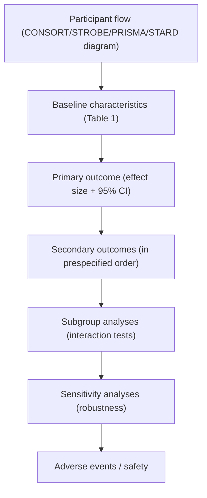

# Results Writing Guide (Medical Research)

## Goal

Report the prespecified analyses faithfully, with enough precision that a reviewer can audit every claim in the Abstract, Introduction, and Discussion against a number in the Results.

## Make Your Point With Data, Not Arguments

The Results section is the most important part of the manuscript for the reader's evaluation of the study. Three principles to write by:

1. **Make the point with data, not with rhetoric.** "The intervention reduced 30-day mortality from 18% to 12% (risk difference -6 percentage points; 95% CI, -9 to -3)" beats "The intervention had a strong protective effect on mortality."
2. **The airplane-reader test.** Write so that a tired reader on a late flight can pick up the manuscript and grasp the message at first reading. If the section requires re-reading or page-flipping, simplify.
3. **Show absolute numbers AND percentages.** "462 of 2,128 (21.7%)" lets the reader judge the magnitude; "21.7%" alone hides the denominator. Pair every percentage with its numerator and denominator at first occurrence.

## Opening Sentence

Do **not** open the Results with study-design verbiage or with a generic table-pointing sentence such as "Table 1 summarizes our findings". The opening should describe the actual study population in clinical terms.

Acceptable opening patterns:

1. `Between [date] and [date], we screened [N] patients; [N] met eligibility, [N] were enrolled, and [N] were included in the primary analysis (Figure 1).`
2. `Of [N] participants randomized, [N] received [intervention] and [N] received [comparator]; baseline characteristics were balanced (Table 1).`

## Statistical vs. Clinical Significance

State the statistical test that produced each p value or coefficient. A statistically significant difference is not the same as a clinically meaningful one. Where the magnitude is small, say so; where the magnitude is clinically meaningful, link it explicitly to the threshold of clinical significance.

## Three Core Questions

1. **Did the prespecified primary analysis answer the question?**
   - Report participant flow first (CONSORT / STROBE / PRISMA / STARD diagram).
   - Report baseline characteristics in Table 1.
   - Report the primary outcome with point estimate, 95% confidence interval, and the prespecified statistical test result.
2. **Are the secondary outcomes and subgroups consistent?**
   - Report secondary outcomes in the prespecified order.
   - Report subgroup analyses with interaction p values, and mark exploratory subgroups as such.
   - Report sensitivity analyses to demonstrate robustness.
3. **Are the safety / adverse-event findings reported completely?**
   - Report adverse events by group, with absolute counts and rates.
   - Distinguish prespecified safety outcomes from emergent ones.

## Results Section Order

## Participant Flow

`Always include a flow diagram. Cite it before the first table.`

For each step, state:

1. Number assessed for eligibility.
2. Number excluded and reason.
3. Number enrolled / allocated.
4. Number followed up (with reason for loss).
5. Number analyzed for the primary outcome (with reason for any exclusion from analysis).

The diagram is mandatory under CONSORT, STROBE, PRISMA, and STARD. Cite it as `Figure 1` in the first paragraph of the Results.

## Baseline Characteristics (Table 1)

Conventions:

1. Group columns by allocation (RCT) or exposure (cohort/case-control).
2. Show counts (%) for categorical variables, mean (SD) or median (IQR) for continuous variables.
3. Do **not** report p values comparing baseline characteristics in randomized trials (CONSORT discourages it).
4. For observational studies, standardized mean differences are preferred over p values to assess balance after matching or weighting.
5. Cite the table in the text once, in order, before the next table.

## Primary Outcome

Writing structure:

1. State the primary outcome value in each group (count, rate, mean, median).
2. State the effect estimate and its 95% CI.
3. State the prespecified statistical test result (p value, where appropriate).
4. Cite the corresponding table or figure.

Sentence skeleton:

1. `The primary outcome occurred in [n/N (%)] participants in the [intervention] group versus [n/N (%)] in the [control] group, corresponding to a [effect measure] of [point estimate] (95% CI, [lower] to [upper]; p = [value]; Table 2; Figure 2).`

## Secondary Outcomes and Subgroups

1. Report secondary outcomes in the prespecified order, with point estimates and CIs.
2. Subgroup analyses: report effect within subgroups, plus the interaction p value. Adjust for multiplicity if prespecified.
3. Mark every post-hoc analysis explicitly: `These analyses were exploratory and not prespecified.`

## Sensitivity Analyses

Use sensitivity analyses to test:

1. The missing-data assumption (e.g., multiple imputation under different mechanisms).
2. The analysis population (ITT vs. per-protocol).
3. The model specification (e.g., adjusted vs. unadjusted, alternative covariates).
4. Outcome ascertainment alternatives.

If a sensitivity analysis materially changes the conclusion, say so plainly.

## Safety / Adverse Events

1. Report all-cause mortality, serious adverse events, and discontinuation due to adverse events as standard.
2. Report common adverse events (≥5% in either group) by system organ class.
3. Distinguish events that meet a prespecified safety endpoint from emergent ones.

## Figure / Table Writing Rules

`Tables and figures are part of communication, not decoration. A reviewer should be able to read Table 1, the primary outcome figure, and the participant flow diagram and understand the paper.`

For full design principles (table-vs-figure decision rule, captions, file formats, accessibility, image-manipulation ethics), see `references/figures-and-tables.md`. For ready-to-use Mermaid templates of the participant flow diagrams and the CARE timeline, plus pointers to the PRISMA2020 R package and DAGitty, see `references/diagrams.md`. The rules below are the Results-section-specific subset.

### Hard rules

1. **Cite every table and figure in the text, in order of appearance.** Number them by first mention. Renumber after every reorganization.
2. Place captions above tables and below figures (most journals).
3. Each table/figure must stand alone: caption must explain the design, the variables, the units, and any abbreviations.
4. Use clean horizontal rules only (top, header-divider, bottom). Avoid vertical rules. Avoid dense `\hline` stacks.
5. Highlight the primary outcome row or column with restraint (bold, light color), not heavy shading.
6. Do not mix unrelated outcomes in a single table.
7. Use consistent decimal precision within a column.
8. State 95% CIs alongside every point estimate.
9. Indicate metric direction in headers when not obvious (e.g., "Lower is better").
10. For forest plots in meta-analyses: state the model (fixed / random effects), the heterogeneity statistic (`I²`, `τ²`), and the test for overall effect.

### Readability

1. Each row label is human-readable (no internal variable names).
2. Each numeric column is right-aligned and has consistent units.
3. Group multi-arm or multi-timepoint results with clear column spans, not vertical separators.
4. Caption is a focused single message; long discussion belongs in the Results paragraph that cites the table.

### Manuscript-level table/figure checklist

1. Tables 1, 2, 3 are cited in that order in the text. (If Table 3 is cited before Table 2, renumber.)
2. Every figure (including supplementary) is cited at least once.
3. Every numerical claim in the Results paragraph matches the table or figure exactly.

## Recommended Analysis Package

1. One Table 1 (baseline characteristics).
2. One primary-outcome table or figure (Table 2 / Figure 2) with point estimate and 95% CI.
3. One secondary outcomes table.
4. One subgroup forest plot (or table with interaction p values).
5. One adverse events / safety table.
6. Supplementary tables for sensitivity analyses.

## Results Rigor Checklist

1. Is the participant flow complete and consistent with the numbers used in every analysis?
2. Are baseline characteristics balanced (RCT) or transparently imbalanced (observational), with appropriate handling described in Methods?
3. Is the primary outcome reported with effect size and 95% CI, and is its number in the Results identical to the number in the Abstract?
4. Are secondary outcomes reported in the prespecified order?
5. Are subgroup and sensitivity analyses reported as prespecified vs. exploratory?
6. Are adverse events reported by group with absolute counts?
7. Is every table and figure cited in the text in order of appearance?
8. Are units, time horizons, and analysis populations stated clearly in each table caption?
